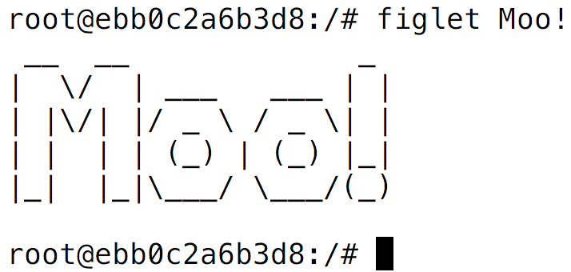

# Initial Hands-On with Docker

Try some of the following

-------------

    docker run hello-world

#### outputs

    > Hello from Docker!
    > This message shows that your installation appears to be working correctly.
    >
    > To generate this message, Docker took the following steps:
    > 1. The Docker client contacted the Docker daemon.
    > 2. The Docker daemon pulled the "hello-world" image from the Docker Hub.
    >    (amd64)
    > 3. The Docker daemon created a new container from that image which runs the
    >    executable that produces the output you are currently reading.
    > 4. The Docker daemon streamed that output to the Docker client, which sent it
    >    to your terminal.
    >
    > To try something more ambitious, you can run an Ubuntu container with:
    > $ docker run -it ubuntu bash
    >
    > Share images, automate workflows, and more with a free Docker ID:
    > https://cloud.docker.com/
    >
    > For more examples and ideas, visit:
    > https://docs.docker.com/engine/userguide/

-------------
    docker run alpine echo hello world

#### outputs

    > hello world

-------------
    docker run -it ubuntu

#### outputs
    > root@ebb0c2a6b3d8:/#

Feel free to play in this shell, nothing you do to the filesystem will
affect your host system.

    root@ebb0c2a6b3d8:/# figlet hello
    > bash: figlet: command not found

    root@ebb0c2a6b3d8:/# apt-get update
    > ...
    > Fetched 25.0 MB in 4s (5170 kB/s)
    > Reading package lists... Done
    > Reading package lists... Done
    > Building dependency tree
    > Reading state information... Done

    root@ebb0c2a6b3d8:/# apt-get install figlet
    > The following NEW packages will be installed:
    >   figlet
    > 0 upgraded, 1 newly installed, 0 to remove and 21 not upgraded.
    > ...
    > Unpacking figlet (2.2.5-2) ...
    > Setting up figlet (2.2.5-2) ...
    > update-alternatives: using /usr/bin/figlet-figlet to provide /usr/bin/figlet (figlet) in auto mode

---------

    root@ebb0c2a6b3d8:/# figlet Moo!

----------------------

    root@ebb0c2a6b3d8:/# ps -ef

    UID        PID  PPID  C STIME TTY          TIME CMD
    root         1     0  0 19:15 pts/0    00:00:00 /bin/bash
    root       256     1  0 19:31 pts/0    00:00:00 ps -ef

---------

    root@ebb0c2a6b3d8:/# exit
    exit

    tscanlan-laptop $ ps -ef
    ....
        0 30474 21117   0  2:36PM ttys002    0:00.00 ps -ef
    89281 84064  1215   0 Sun02PM ttys003    0:00.09 /Applications/iTerm.app/Contents/MacOS/iTerm2 --server /usr/bin/login -fpl tscanlan /Applications/iTerm.app/Contents/MacOS/iTerm2 --launch_shell
        0 84065 84064   0 Sun02PM ttys003    0:00.03 /usr/bin/login -fpl tscanlan /Applications/iTerm.app/Contents/MacOS/iTerm2 --launch_shell
    89281 84070 84065   0 Sun02PM ttys003    0:20.87 -bash

-----------

Note that starting a new container starts from the same initial filesystem:

    tscanlan-laptop $ docker run -it ubuntu
    root@00c56022d3ae:/# figlet
    bash: figlet: command not found
