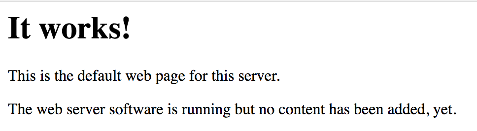
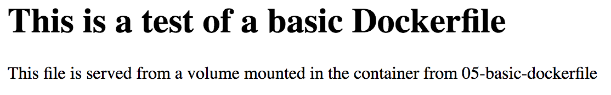

# Simple docker image

The [Dockerfile](Dockerfile) in this directory will provide  a simple
web service based on apache for serving static content.

If no volumes are bound to the container at run time, then the content
served is part of the image.  If a volume is mounted at `/var/www` in the
container, that content is served by apache.

When the container is running, you can access the service by opening
a web browser to http://localhost:9080/.

When no volume is mounted, you should see

And with the local directory bound you will see:

# Build

    docker build -t 05-basic-dockerfile:latest .

# Run

## run foreground, no volumes
This will run the container but keep your console session attached to the
container.  Use `ctl-c` to kill to container when done

    docker run --rm -p 9080:80 05-basic-dockerfile:latest

## run daemonized, no volumes

    docker run -d --name basic-dockerfile-apache -p 9080:80 05-basic-dockerfile:latest

    docker stop basic-dockerfile-apache
    docker rm basic-dockerfile-apache

## run daemonized, no volumes, remove on stop

    docker run -d --rm --name basic-dockerfile-apache -p 9080:80 05-basic-dockerfile:latest

    docker stop basic-dockerfile-apache

## run daemonized, with volumes, remove on stop

    docker run -d --rm --name basic-dockerfile-apache -p 9080:80 -v $PWD:/var/www 05-basic-dockerfile:latest
    docker stop basic-dockerfile-apache

## run, stop, start, and restart container
    docker run -d --name basic-dockerfile-apache -p 9080:80 05-basic-dockerfile:latest
    docker stop basic-dockerfile-apache
    docker start basic-dockerfile-apache
    docker restart basic-dockerfile-apache

    docker rm basic-dockerfile-apache
